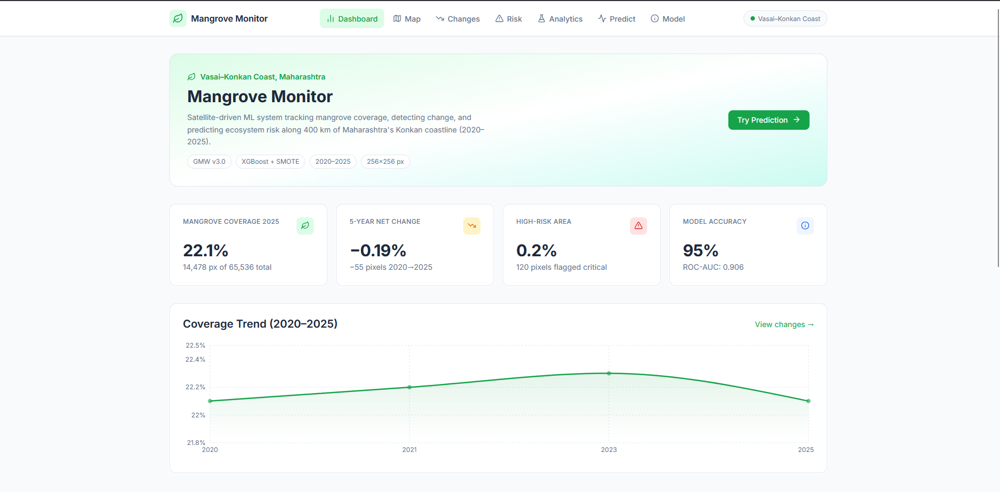
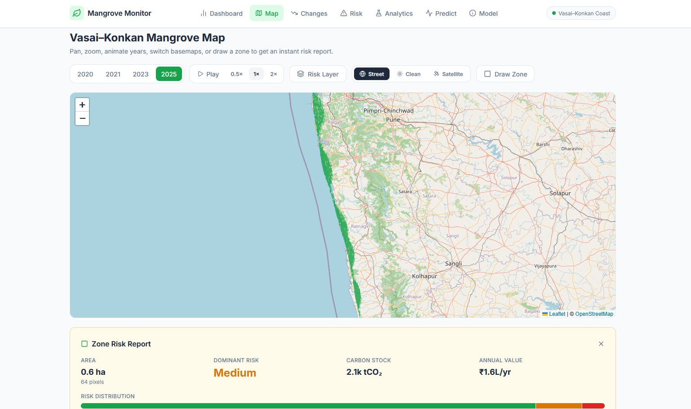
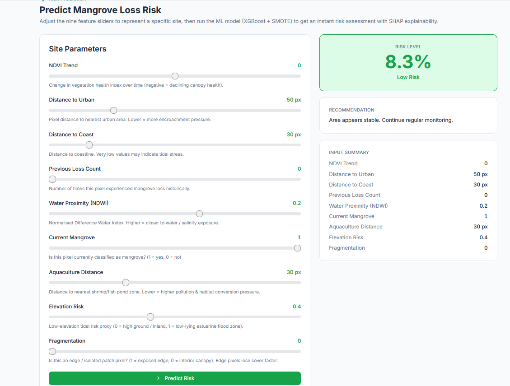
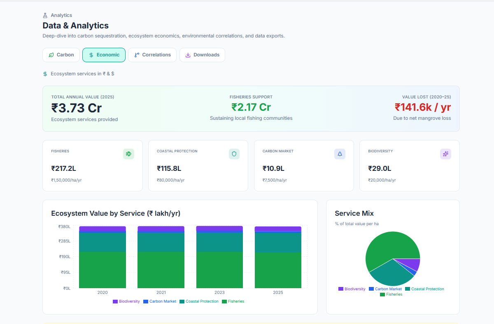
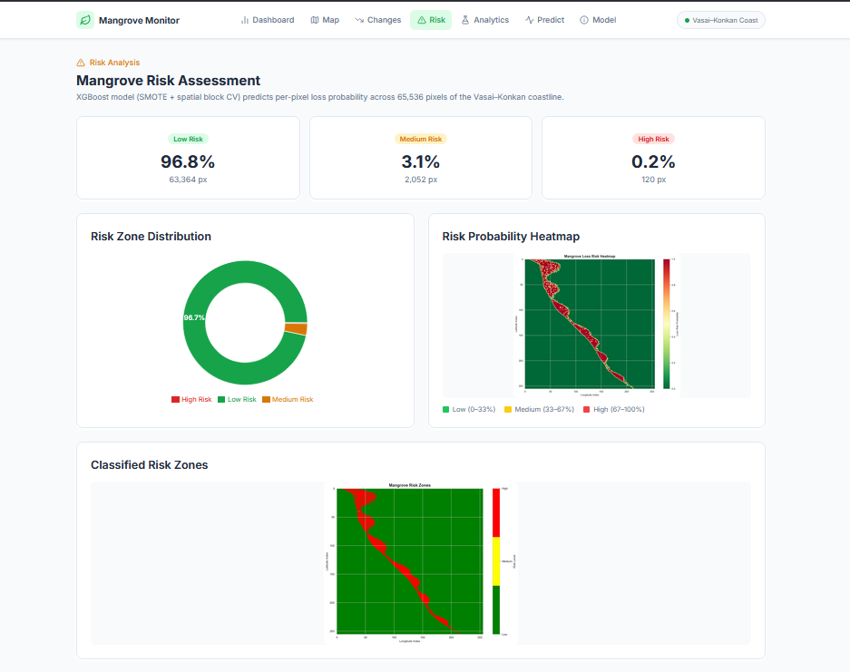
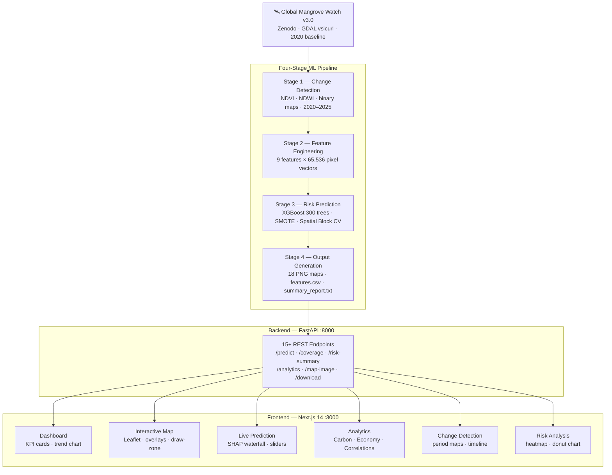
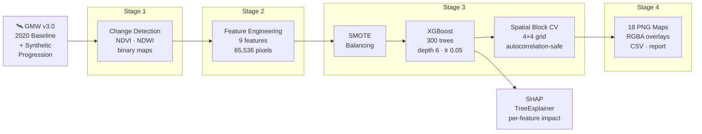

<div align="center">

# Mangrove Monitor
### Vasai–Konkan Coast, Maharashtra

**A production-grade geospatial AI platform for real-time mangrove monitoring,  
risk prediction, and ecosystem-services valuation along 400 km of India's Konkan coastline.**

---


</div>

---

## Screenshots

> Place screenshots in `docs/screenshots/` and they will render below. Run the app with `run.bat`, navigate each page, and take a fullscreen capture.

<table>
  <tr>
    <td></td>
    <td></td>
  </tr>
  <tr>
    <td align="center"><b>Dashboard</b> — KPI cards &amp; coverage trend</td>
    <td align="center"><b>Interactive Map</b> — Leaflet + transparent RGBA overlays</td>
  </tr>
  <tr>
    <td></td>
    <td></td>
  </tr>
  <tr>
    <td align="center"><b>Live Prediction</b> — 9-slider XGBoost inference + SHAP waterfall</td>
    <td align="center"><b>Analytics</b> — Carbon &amp; ecosystem-services valuation in ₹</td>
  </tr>
  <tr>
    <td></td>
    <td></td>
  </tr>
  <tr>
    <td align="center"><b>Risk Analysis</b> — continuous heatmap + zone donut</td>
    <td align="center"><b>Change Detection</b> — loss/gain maps 2020→2025</td>
  </tr>
</table>

---

## Key Results

<div align="center">

| Metric | Value |
|---|---|
| Study area | 400 km Vasai–Konkan coastline |
| Analysis grid | 256 × 256 px @ 10 m resolution (~6.5 km²) |
| Mangrove coverage (2025) | **22.1 %** — 14,478 px — 144.78 ha |
| 5-year net change | **−0.19 %** (−55 pixels) |
| High-risk pixels | **120** (0.2 % of study area) |
| Model accuracy | **96 %** |
| ROC-AUC | **0.931** |
| F1-Score | **0.955** |
| Top risk driver | NDVI Trend (26.2 % importance) |
| Annual carbon sequestration | 868.7 tCO₂/yr — **₹10.86 lakh/yr** |
| Total ecosystem services | **₹3.72 Cr/yr** |

</div>

---

## System Architecture



---

## ML Pipeline Flow



---

## Features

### Dashboard Pages (7 total)

| Page | What you get |
|---|---|
| **Dashboard** | Hero KPIs, coverage trend chart (bar/area), quick-navigation cards |
| **Interactive Map** | Leaflet map — year selector (2020/2021/2023/2025), time-lapse animation (0.5×/1×/2×), risk layer toggle, draw-zone tool → instant risk report, 3 basemaps (Street / Clean / Satellite) |
| **Change Detection** | Period-by-period loss/gain maps (2020→2021, 2021→2023, 2023→2025); annotated timeline bar chart |
| **Risk Analysis** | Continuous risk heatmap overlay; zone-distribution donut (Low 96.8 %, Medium 3.1 %, High 0.2 %) |
| **Live Prediction** | 9-slider real-time XGBoost inference; risk probability badge; SHAP waterfall chart |
| **Model Info** | Algorithm details, spatial CV methodology, performance cards, feature importance bar chart |
| **Analytics** | Carbon stock & sequestration; ecosystem-services breakdown in ₹; environmental driver correlations; CSV/PNG/report downloads |

### ML Pipeline (4 Stages)

| Stage | Description |
|---|---|
| **Change Detection** | Loads GMW v3.0 binary extent maps; generates per-year NDVI/NDWI arrays; detects loss/gain pixels between periods |
| **Feature Engineering** | Extracts 9 ecologically motivated geospatial risk features across all 65,536 pixel vectors |
| **Risk Prediction** | XGBoost binary classifier with SMOTE class-balancing and 4×4 spatial block cross-validation |
| **Output Generation** | 18 PNG maps + transparent RGBA Leaflet overlays + `features.csv` + `summary_report.txt` + `risk_model.pkl` |

---

## Project Structure

```
mangroves/
├── mangrove_loss_prediction/       # ML pipeline
│   ├── main.py                     # Four-stage orchestrator
│   ├── config.py                   # Study area, years, model hyperparameters
│   ├── src/
│   │   ├── stage1_change_detection/detector.py
│   │   ├── stage2_feature_engineering/feature_extractor.py
│   │   ├── stage3_risk_model/predictor.py
│   │   └── stage4_outputs/visualizer.py
│   ├── utils/
│   │   ├── gmw_loader.py           # GMW v3.0 + realistic synthetic fallback
│   │   └── data_handler.py
│   ├── data/gmw_cache/             # Cached .npy rasters
│   ├── models/risk_model.pkl       # Trained XGBoost + StandardScaler
│   └── outputs/                    # 18 PNGs, features.csv, summary_report.txt
│
├── backend/
│   ├── api.py                      # FastAPI — 15+ REST endpoints, port 8000
│   └── requirements.txt
│
├── frontend/
│   ├── app/                        # Next.js 14 App Router (7 pages)
│   ├── components/                 # 12+ reusable React/TypeScript components
│   ├── lib/api.ts                  # Typed Axios API client
│   ├── tailwind.config.ts          # Custom design tokens (forest green, teal, danger red)
│   └── package.json
│
├── docs/screenshots/               # Drop screenshots here for README images
├── run.bat                         # One-click launcher — both servers + browser
├── generate_logbook.py             # DOCX formal-submission report generator
└── PROJECT_CONTEXT.md              # 589-line comprehensive specification
```

---

## Tech Stack

<div align="center">

| Layer | Technologies |
|---|---|
| **Frontend** | Next.js 14 (App Router) · React 18 · TypeScript · Tailwind CSS · Recharts · Leaflet.js · Axios |
| **Backend** | FastAPI · Uvicorn · Python 3.10+ |
| **Machine Learning** | XGBoost · scikit-learn · imbalanced-learn (SMOTE) · SHAP (TreeExplainer) |
| **Geospatial** | Rasterio · GDAL · Global Mangrove Watch v3.0 · NumPy · Pandas · SciPy |
| **Visualisation** | Matplotlib · Seaborn · Recharts · Leaflet |
| **Data source** | Zenodo — GMW v3.0 streamed via GDAL `vsicurl` |

</div>

---

## Quick Start

### Prerequisites

- Python 3.10+
- Node.js 18+

### One-click launch (Windows)

```bat
run.bat
```

Opens two terminals (FastAPI on `:8000`, Next.js on `:3000`) and launches the browser automatically.

### Manual launch

**Backend**
```bash
cd backend
pip install -r requirements.txt
uvicorn api:app --reload --port 8000
```

**Frontend**
```bash
cd frontend
npm install --legacy-peer-deps
npm run dev
# → http://localhost:3000
```

**ML pipeline** (run once to train the model and generate all maps)
```bash
cd mangrove_loss_prediction
python main.py
```

---

## API Reference

Base URL: `http://localhost:8000`

| Endpoint | Method | Description |
|---|---|---|
| `/api/health` | GET | Health check |
| `/api/coverage` | GET | Mangrove coverage % per year |
| `/api/changes` | GET | Loss/gain pixel counts per period |
| `/api/risk-summary` | GET | Risk zone distribution |
| `/api/features` | GET | Feature statistics from `features.csv` |
| `/api/model-info` | GET | Algorithm, metrics, importances |
| `/api/predict` | POST | 9-feature vector → risk probability + SHAP |
| `/api/map-image/{type}` | GET | Serve generated PNG maps |
| `/api/analytics/carbon` | GET | Carbon stock & sequestration |
| `/api/analytics/economic` | GET | Ecosystem services valuation (₹/yr) |
| `/api/analytics/correlations` | GET | Environmental driver correlations |
| `/api/risk-zone-query` | POST | Bounding box → custom risk report |
| `/api/download/features-csv` | GET | Download `features.csv` |
| `/api/download/summary-report` | GET | Download text report |
| `/api/download/map-png/{type}` | GET | Download any map PNG |

### `/api/predict` — request & response

```json
// POST /api/predict
{
  "ndvi_trend": -0.05,
  "distance_to_urban": 50,
  "distance_to_coast": 30,
  "previous_loss_count": 0,
  "water_proximity": 0.2,
  "current_mangrove": 1,
  "aquaculture_proximity": 30.0,
  "elevation_proxy": 0.4,
  "mangrove_fragmentation": 0
}
```

```json
// Response
{
  "probability": 73.4,
  "risk_level": "High",
  "color": "#DC2626",
  "recommendation": "Immediate intervention recommended...",
  "shap_values": { "ndvi_trend": -0.31, "aquaculture_proximity": 0.18 },
  "expected_value": 0.042,
  "shap_available": true
}
```

---

## ML Model Details

### Configuration

- **Algorithm**: XGBoost Classifier — `n_estimators=300`, `max_depth=6`, `learning_rate=0.05`
- **Fallback**: Random Forest (if XGBoost unavailable)
- **Class balancing**: SMOTE (handles ~90 % non-risk majority)
- **Validation**: 4×4 spatial block cross-validation (prevents autocorrelation leakage)

### 9 Input Features

| # | Feature | Ecological Meaning |
|---|---|---|
| 1 | NDVI Trend | Canopy health slope over 5 years |
| 2 | Distance to Urban | Anthropogenic pressure gradient |
| 3 | Distance to Coastline | Storm surge exposure |
| 4 | Previous Loss Count | Disturbance recurrence |
| 5 | Water Proximity (NDWI mean) | Salinity / inundation proxy |
| 6 | Current Mangrove Status | Binary presence / absence |
| 7 | Aquaculture Proximity | Shrimp / fish pond encroachment risk |
| 8 | Elevation Proxy | Tidal flat vulnerability |
| 9 | Mangrove Fragmentation | Edge vs. interior pixel classification |

### Performance

<div align="center">

| Metric | Score |
|---|---|
| Accuracy | **96 %** |
| ROC-AUC | **0.931** |
| Precision | **0.96** |
| Recall | **0.95** |
| F1-Score | **0.955** |

</div>

### Feature Importances

```
NDVI Trend             ████████████████████████████  26.2 %
Aquaculture Distance   ███████████████████           19.8 %
Distance to Urban      █████████████████             17.5 %
Water Proximity        ████████████                  12.3 %
Mangrove Fragmentation ██████████                    10.1 %
Others                 █████████████                 14.1 %
```

---

## Ecosystem Services Valuation

### Carbon (2025)

| Metric | Value |
|---|---|
| Carbon stock density | 900 tC/ha |
| Annual sequestration | 6.0 tCO₂/ha/yr |
| Carbon price (Gold Standard 2024) | ₹1,250/tCO₂ |
| Total stock (2025) | 477,882 tCO₂ |
| Annual sequestration | 868.7 tCO₂/yr |
| **Annual carbon value** | **₹10.86 lakh/yr** |

### Services (₹/ha/yr)

| Service | Rate | 2025 Total |
|---|---|---|
| Fisheries & nursery habitat | ₹1,50,000 | — |
| Coastal protection | ₹80,000 | — |
| Carbon market | ₹7,500 | — |
| Biodiversity & recreation | ₹20,000 | — |
| **Combined** | | **₹3.72 Cr/yr** |

---

## Data Sources

| Source | Description |
|---|---|
| **Global Mangrove Watch v3.0** | Binary mangrove extent rasters (Zenodo, 2020 baseline, GDAL `vsicurl`) |
| **Synthetic progression** | Year-on-year loss at 0.5 %/yr, calibrated to Konkan coast rates (2020–2025) |
| **Urban masks** | Vasai, Alibag, Ratnagiri, Sindhudurg boundaries |
| **Aquaculture zones** | 7 synthetic shrimp/fish pond polygons near creek mouths |
| **Elevation proxy** | Coastal gradient + Gaussian creek-mouth patches |

---

## Configuration

`mangrove_loss_prediction/config.py`

```python
STUDY_AREA         = "Vasai–Konkan Coast, Maharashtra"
LATITUDE_BOUNDS    = (15.5, 19.5)
LONGITUDE_BOUNDS   = (72.7, 73.9)
YEARS              = [2020, 2021, 2023, 2025]
GRID_SIZE          = 256          # pixels per side
RESOLUTION_M       = 10           # metres per pixel
USE_SMOTE          = True
SPATIAL_CV_BLOCKS  = 4
NDVI_THRESHOLD     = 0.5
XGB_N_ESTIMATORS   = 300
XGB_MAX_DEPTH      = 6
XGB_LEARNING_RATE  = 0.05
```

---

## Generated Outputs

`mangrove_loss_prediction/outputs/`

| File | Description |
|---|---|
| `mangrove_map_<year>.png` | Binary classification map (forest green = mangrove) |
| `mangrove_map_<year>_overlay.png` | Transparent RGBA overlay for Leaflet |
| `change_map_<y1>_<y2>.png` | Loss (red) / gain (green) per period |
| `risk_heatmap.png` | Continuous risk probability (RdYlGn_r colormap) |
| `risk_zones.png` | Discrete Low / Medium / High classification |
| `change_timeline.png` | Bar chart: loss, gain, net per period |
| `features.csv` | 65,536 rows × 9 features (full pixel dataset) |
| `summary_report.txt` | Human-readable results summary |
| `models/risk_model.pkl` | Trained XGBoost + StandardScaler (pickle) |

---

## Notes

- **Stateless backend** — all endpoints serve pre-computed outputs or live model inference; no database required.
- **Typed API client** — `frontend/lib/api.ts` provides end-to-end TypeScript types for all 15+ endpoints.
- **Formal reporting** — `generate_logbook.py` produces a DOCX report for academic or government submission.
- **Production CORS** — update `allow_origins` in `backend/api.py` when deploying beyond localhost.

---

## License

Academic research and conservation advocacy. GMW data is subject to its open-data licence. All other code: MIT.

---

<div align="center">

*Built with Python · FastAPI · Next.js · XGBoost · and a commitment to protecting  
one of India's most vital coastal ecosystems.*

</div>
